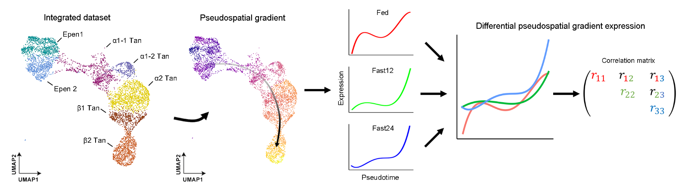
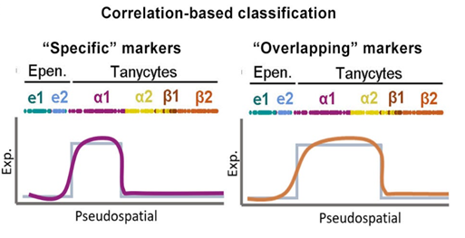
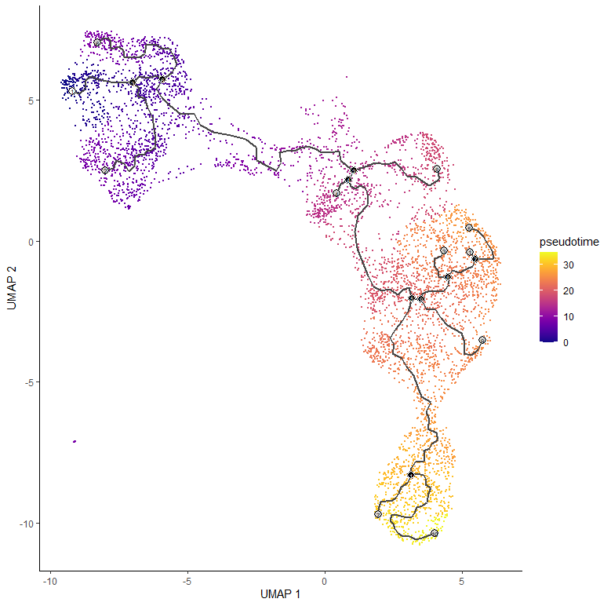

# DPGEA

<p align="center">
  
  <center>Illustrative picture of the original workflow used in https://www.biorxiv.org/content/10.1101/2023.07.06.547914v1</center>
</p>

Differential Pseudospatial Gradient Expression Analysis

This repository provides a framework to explore scRNAseq datasets displaying pseudospatial distributions. The function calculates Differential Pseudospatial Gradient Expression (DPGEA) as transitional points within the pseusopace calculated using Monocle3. 

The repository allow to replicate the analysis available in Brunner et al. (2024) to identify tanycyte/ependyma specific and overlaping markers. The analysis can be done using the TanCDS file(downsampled) available in this repository.

<p align="center">
  
</p>

## Installation & System Requirements

DPGEA is supported in Windows, MAC OS and Linux and requires only a standard computer with enough RAM to support the in-memory operations.

DPGEA requires to have installed the package Seurat, monocle3 and Hmisc.
```
if (!requireNamespace("BiocManager", quietly = TRUE))
    install.packages("BiocManager")

BiocManager::install("Seurat","monocle3", "Hmisc")
library(devtools)

devtools::install_github("dalodriguez/DPGEA")

library(DPGEA)
```

## Workflow
<ul>
  <li><b>Preparing your data</b></li>
</ul>

This step can be skipped using the TanCDS file available in this repository. 

To use the DPGEA function you are required to provide a cell data set object where a pseudotime/pseudospace trajectory has been calculated. Please refer to monocle3 vignettes. As an example you can use the following code: 


```
library(Seurat)
library(monocle3)

ToMonocle3 <- function(seurat_object,
                       scale_all = FALSE,
                       assay = "SCT",
                       reduction_for_projection = "pca",
                       UMAP_cluster_slot = NULL){

  if(scale_all){
    message("Getting residuals for all Seurat genes in chosen assay slot and placing in scale.data")
    seurat_genes <- rownames(seurat_object[[assay]])
    remaining_genes <- setdiff(seurat_genes, rownames(seurat_object[[assay]]@scale.data))
    if(assay == "SCT"){
      seurat_object <- Seurat::GetResidual(seurat_object, features = remaining_genes, assay = assay, umi.assay = "RNA")
    } else {
      seurat_object <- Seurat::ScaleData(seurat_object, features = rownames(seurat_object[[assay]]))
    }
  }

  #We prep the seurat object by creating gene loadings for ALL genes in the Seurat scale.data slot. This is done to allow downstream monocle3 functions on gene_modules to work appropriately.
  message("Projecting gene loadings for all Seurat genes in scale.data slot")
  seurat_object <- Seurat::ProjectDim(seurat_object, reduction = reduction_for_projection, assay = assay)

  ##################

  message("Initializing CDS object")

  #Extract Seurat's log-transformed values
  expression_matrix <- Seurat::GetAssayData(seurat_object, assay = assay, slot = "counts")
  #Extract Seurat meta_data
  meta_data <- seurat_object@meta.data
  #Extract gene names from Seurat object SCT slot to make CDS
  seurat_genes <- data.frame(gene_short_name = rownames(seurat_object[[assay]]),
                             row.names = rownames(seurat_object[[assay]]))
  new_cds <- monocle3::new_cell_data_set(expression_data = expression_matrix, cell_metadata = meta_data, gene_metadata = seurat_genes)

  ##################

  message("Making an SCE object from the Seurat object to facilitate transfer of information from SCE to CDS")
  sce <- as.SingleCellExperiment(seurat_object, assay = assay)
  message("Loading in all Seurat reductions (PCA, HARMONY, UMAP, etc.) into CDS")
  SingleCellExperiment::reducedDims(new_cds) <- SingleCellExperiment::reducedDims(sce)
  message("Loading in specified Seurat assay into CDS")
  SummarizedExperiment::assays(new_cds) <- SummarizedExperiment::assays(sce)
  message("Loading in Seurat gene names into CDS")
  SummarizedExperiment::rowData(new_cds) <- SummarizedExperiment::rowData(sce)
  SummarizedExperiment::rowData(new_cds)$gene_short_name <-  row.names(new_cds)
  message("Loading in Seurat gene loadings into CDS")
  # new_cds@preprocess_aux$gene_loadings <- seurat_object@reductions[[reduction_for_projection]]@feature.loadings.projected

  ##################

  message("Get user specified selected clusters (or active idents) from Seurat and load into CDS")
  if(is.null(UMAP_cluster_slot)){
    list_cluster <- Idents(seurat_object)
  } else {
    Idents(seurat_object) <- UMAP_cluster_slot
    list_cluster <- Idents(seurat_object)
  }
  new_cds@clusters[["UMAP"]]$clusters <- list_cluster
  #The next two commands are run in order to allow "order_cells" to be run in monocle3
  rownames(new_cds@principal_graph_aux[['UMAP']]$dp_mst) <- NULL
  colnames(SingleCellExperiment::reducedDims(new_cds)[["UMAP"]]) <- NULL

  ##################

  message("Setting all cells as belonging to one partition (multiple partitions not supported yet)")
  recreate_partition <- c(rep(1, length(new_cds@colData@rownames)))
  names(recreate_partition) <- new_cds@colData@rownames
  recreate_partition <- as.factor(recreate_partition)
  new_cds@clusters[["UMAP"]]$partitions <- recreate_partition

  ##################
  message("Done")
  new_cds
}

cds <- ToMonocle3(seurat_object)

cds <- learn_graph(cds)

cds <- order_cells(cds)

```

Following this approach, embeddings and meta.data from the seurat object are conserved in the cell_data_set object. Meta data can be retrieved from "cds@colData@listData". The pseudospatial trajectory can be visualized by using the plot_cells() function.


```
plot_cells(cds, color_cells_by = "pseudotime")
```


<p align="center">
  
</p>

<ul>
  <li><b>The DPGEA function</b></li>
</ul>

The DPGEA function calculate whether each feature in the matrix correlate with a single cell type or whether they overlap several adjacent populations. The function provides a list of dataframes including the correlation matrix, the p_value matrix and the final classification. 

The DPGEA function requires a cell data set and the columns names of the cds@colData@listData object containing the cell type and condition information. A sample dataset is available in the repository. 

```
data("TanCDS")
DPGEA <- DPGEA(cds,  condition= "condition", threshold= 0.01, count_thres = 0 )
```


## Suggestions and contributions 
Please use github issue tracker to report coding related issues or contact me directly, https://dlopez-rodriguez.ch/Contact/

## How to cite?
M. Brunner&#185;, D. Lopez-Rodriguez&#185;, A. Messina, B. Thorens, F Santoni&#178;, F. Langlet&#178;. Pseudospatial transcriptional gradient analysis of hypothalamic ependymal cells: towards a new tanycyte classification. BioRxiv preprint. https://doi.org/10.1101/2023.07.06.547914

&#185; Co-First Author

&#178; Co-Last Author

https://www.biorxiv.org/content/10.1101/2023.07.06.547914v1


   


## License
This project is covered under the Creative Commons Zero v1.0 Universal Licnse


